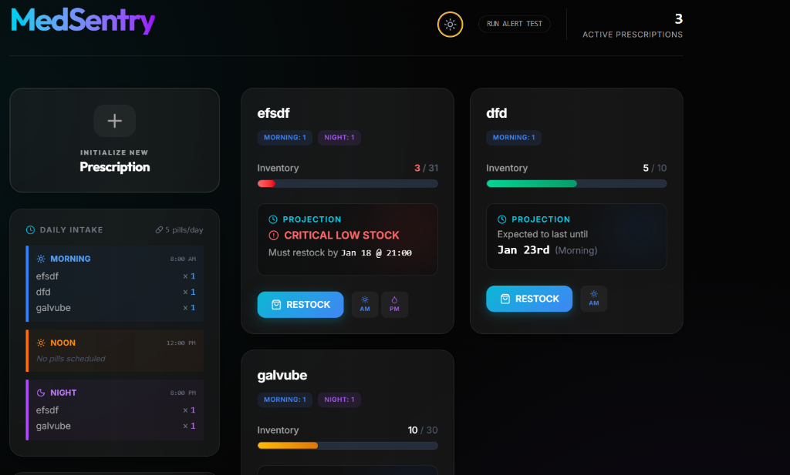
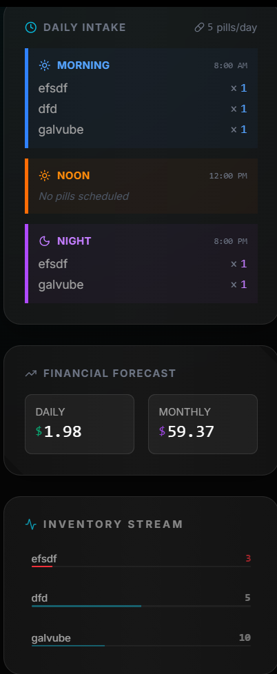
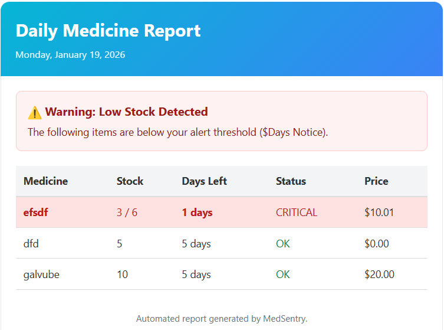

# MedSentry

**MedSentry** is a premium, Electron-based desktop application designed for precision medication tracking. It combines a high-end aesthetic with intelligent inventory management and automated alerting systems, ensuring you never miss a dose or run out of essential stock.

## 🌟 Visual Overview

<div align="center">

### Main Dashboard


*Intuitive control center for all prescriptions*

---

### Daily Schedule & Insights


*Track morning, noon, and night dosages with financial forecasting*

---

### Prescription Management


*Seamlessly add and configure new medication trackers*

---

### Automated Email Alerts


*Receive real-time stock warnings powered by Resend*

</div>

## ✨ Key Features

- **🛡️ Inventory Management**: Real-time tracking of medicine stock levels with visual progress bars.
- **🧠 Smart Projections**: Intelligent logic that calculates when your stock will run out based on dosage.
- **📧 Automated Alerts**: Receive "Low Stock" and "Critical" notifications directly to your email.
- **🌓 Dual Theme Support**: Seamlessly switch between sleek Dark mode and clean Light mode.
- **💎 Premium UI/UX**: Professional design featuring glassmorphism and neon accents.
- **📈 Financial Insights**: Track daily and monthly costs associated with your prescriptions.
- **💻 Native Experience**: High-performance desktop integration using Electron.

## 🛠️ Tech Stack

- **Framework**: [Electron](https://www.electronjs.org/)
- **Frontend**: [React](https://react.dev/) / [TypeScript](https://www.typescriptlang.org/)
- **Styling**: [TailwindCSS](https://tailwindcss.com/)
- **Email Service**: [Resend](https://resend.com/)

## 🚀 Getting Started

### Prerequisites

Ensure you have [Node.js](https://nodejs.org/) installed on your system.

### Installation

1.  **Clone the repository**:
    ```bash
    git clone https://github.com/your-repo/medsentry.git
    cd med
    ```

2.  **Install dependencies**:
    ```bash
    npm install
    ```

3.  **Configure Environment**:
    Create a `.env` file in the root directory and add the following:
    ```env
    RESEND_API_KEY=your_resend_api_key_here
    EMAIL_RECEIVER=your_email@example.com
    ```

### Running Locally

To start the application in development mode:
```bash
npm run dev
```

To build for production:
```bash
npm run build
```

---

